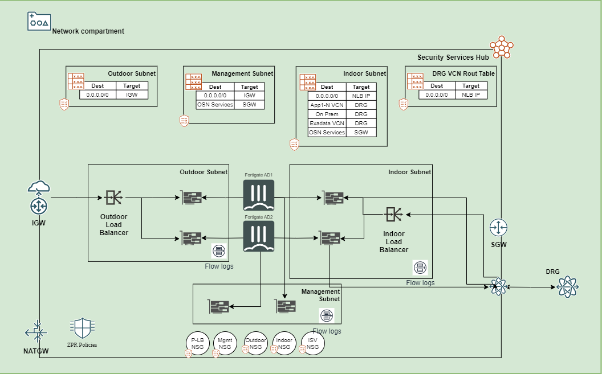

# oci-aa-drg

This Terraform deploys Active/Active FortiGate into an existing Oracle Landing Zone, containing 3 subnets.  Generally, these are named as (Management, Indoor and Outdoor).  This document assumes that all VCN and subnet routing is pre-configured, along with Internet Gateways, etc.  You will need to modify the defaults in variables.tf to match your existing address space.

You may run into an issue where cloudinit fails to load the full FortiGate Configuration.  Usually, this happens on the vNICs attached to the instance after initial bootup.  You will need to ssh to the FortiGate and issue the ```exec factoryreset``` command.  This will cause the cloudinit to run again.  When the device comes up, it should be functioning properly:


**Overview**



